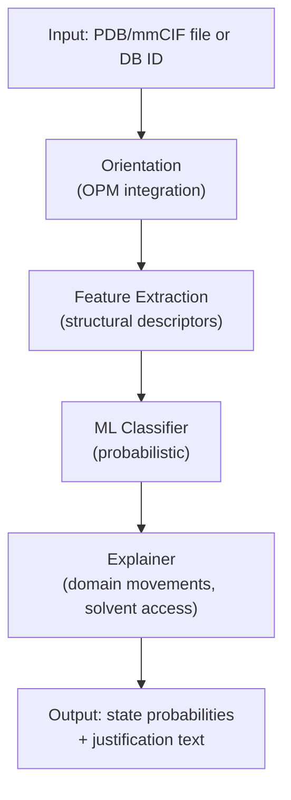

# ConfoState High-Level Plan

**Date:** 2026-06-01  
**Status:** Draft — under discussion

## Overview

A phased plan for building ConfoState — a reproducible framework that classifies membrane protein structures into literature-defined conformational states, with probabilistic output, human-readable justifications, a CLI, and a Python API.

---

## Architecture Overview



---

## Phase 1: Data Foundation

Goal: Curate a labelled reference dataset that grounds state labels in the literature.

- Select representative membrane protein families (e.g. secondary active transporters, ABC transporters, GPCRs)
- For each family, define the conformational state vocabulary from review papers (alternating access: OF, IF, occluded, etc.)
- Fetch structures from [RCSB PDB](https://www.rcsb.org/) and link each to its primary publication via PDB metadata
- Pull supporting literature from PMC / bioRxiv / arXiv to extract state assignments
- Retrieve membrane orientation for each structure from [OPM](https://opm.phar.umich.edu/) (use existing entries or submit new jobs)
- Store annotated dataset in a versioned, machine-readable format (e.g. CSV + structure files in `data/`)

Key files to create:
- `data/annotations/` — per-family state labels
- `data/structures/` — fetched PDB files
- `confostate/data/` — loader utilities

---

## Phase 2: Feature Engineering

Goal: Translate 3D structure into numerical descriptors that capture conformational state.

Core descriptors:
- **Cavity / solvent accessibility** — volume and accessibility of the substrate-binding site (inward vs. outward facing)
- **Domain distances** — distances or angles between key helices / domains known to move during the conformational cycle
- **Reference-structure comparison** — RMSD to a set of curated reference structures per state
- **Internal repeat symmetry** — pseudo-symmetry scores between repeated structural units (relevant for transporters; see DOI 10.1146/annurev-biophys-051013-023008)
- **OPM tilt/rotation** — orientation relative to the membrane

Key files to create:
- `confostate/features/` — one module per descriptor type

---

## Phase 3: ML Classifier

Goal: Train a model that outputs a probability distribution over conformational states.

- Start with a simple interpretable baseline (e.g. logistic regression, random forest) before moving to deep models
- Train per-family models initially; consider a cross-family model later
- Output: probability vector over states, e.g. `{IF: 0.75, IF_occluded: 0.25}`
- Evaluate on held-out test set; report per-family performance

Key files to create:
- `confostate/models/` — training, inference, evaluation
- `confostate/models/registry.py` — mapping family → trained model artifact

---

## Phase 4: Explainability

Goal: Generate human-readable justifications tied to the literature.

- For each prediction, report which features drove the classification
- Map features back to domain language (e.g. "TM1–TM7 distance consistent with inward-open state as described in Smith et al. 2021")
- Cite the specific PDB references and papers used for comparison

Key files to create:
- `confostate/explain/` — feature-to-text rendering

---

## Phase 5: Interfaces

Goal: Deliver a CLI and a Python API matching user stories 4 and 5.

**CLI** (`confostate classify`)
- Accepts a PDB/mmCIF path or a PDB ID
- Flags for family override, output format (JSON, plain text)
- Outputs state probabilities + justification to stdout or file

**Python API**
```python
from confostate import Classifier
clf = Classifier(family="transporter")
result = clf.classify("structure.pdb")
# result.states  -> {"IF": 0.75, "IF_occluded": 0.25}
# result.explain -> human-readable text
```

Key files to create:
- `confostate/cli.py` — Click-based CLI
- `confostate/__init__.py` — public API surface
- `pyproject.toml` — packaging

---

## Suggested Milestone Order

- Milestone 1: data pipeline + OPM integration + annotated dataset for one family
- Milestone 2: feature extraction for that family + baseline classifier
- Milestone 3: evaluation loop + explainability layer
- Milestone 4: CLI + Python API
- Milestone 5: expand to additional protein families
